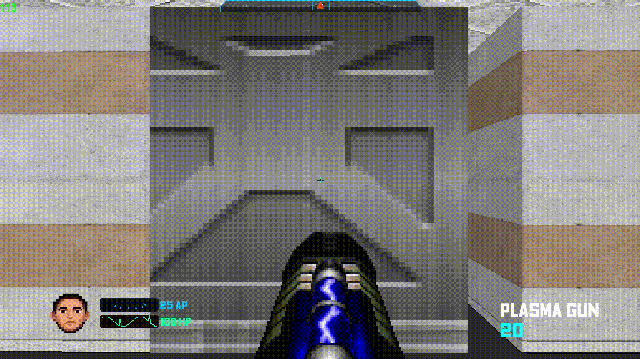

## 🗂️ ОГЛАВЛЕНИЕ
* [1. ⚔️ ВИЗИТНАЯ КАРТОЧКА ПРОЕКТА](#1-️-визитная-карточка-проекта)
  * [1.1. Сюжетная завязка и Лор](#11-сюжетная-завязка-и-лор)
  * [1.2. Ключевые особенности игры (Features)](#12-ключевые-особенности-игры-features)
  * [1.3. Стек технологий и спецификация зависимостей](#13-стек-технологий-и-спецификация-зависимостей)
  * [1.4. Быстрый старт и развертывание](#14-быстрый-старт-и-развертывание)
* [2. 🗺️ ОБЩЕЕ ДЕРЕВО ФАЙЛОВ СИСТЕМЫ](#2-️-общее-дерево-файлов-системы)
* [3. 🏛️ КОМПОНЕНТНО-ОРИЕНТИРОВАННАЯ АРХИТЕКТУРА И МЕНЕДЖЕРЫ](#3-️-компонентно-ориентированная-архитектура-и-менеджеры)
  * [3.1. Паттерн проектирования движка](#31-паттерн-проектирования-движка)
  * [3.2. Менеджеры ядра пространственной обработки (Core Managers)](#32-менеджеры-ядра-пространственной-обработки-core-managers)
  * [3.3. Менеджеры верхнего уровня логики и ресурсов (Upper Managers)](#33-менеджеры-верхнего-уровня-логики-и-ресурсов-upper-managers)
  * [3.4. Схема работы игрового цикла (Update/Draw)](#34-схема-работы-игрового-цикла-updatedraw)
* [4. 📂 DATA-DRIVEN КОНТУР И СИСТЕМА КОНФИГУРАТОРОВ](#4--data-driven-контур-и-система-конфигураторов)
  * [4.1. Декларативное управление биомами (biome_data.py)](#41-декларативное-управление-биомами-biome_datapy)
  * [4.2. Центральный реестр сущностей (game_data.py)](#42-центральный-реестр-сущностей-game_datapy)
  * [4.3. Изолированный профиль пользователя (user_settings.py)](#43-изолированный-профиль-пользователя-user_settingspy)
* [5. 👁️ ЯДРО РЕНДЕРИНГА И СГЛАЖИВАНИЯ (CORE RENDERING)](#5-️-ядро-рендеринга-и-сглаживания-core-rendering)
  * [5.1. Ускорение DDA-рейкастинга через Numba JIT](#51-ускорение-dda-рейкастинга-через-numba-jit)
  * [5.2. Алгоритм многоуровневого Mip-Mapping текстур](#52-алгоритм-многоуровневого-mip-mapping-текстур)
  * [5.3. Панорамный фон задника](#53-панорамный-фон-задника)
  * [5.4. Хоррор-фильтр визора и волновой туман дальности](#54-хоррор-фильтр-визора-и-волновой-туман-дальности)
* [6. 🎛️ ИНТЕРФЕЙС И UI-ФИЧИ (SCI-FI HUD PACK)](#6-️-интерфейс-и-ui-фичи-sci-fi-hud-pack)
  * [6.1. BIOS Boot Screen, Главное меню и HUD Паузы](#61-bios-boot-screen-главное-меню-и-hud-паузы)
  * [6.2. Интерактивный Keybinding без размытия](#62-интерактивный-keybinding-без-размытия)
  * [6.3. Геометрия тактического колеса оружия](#63-геометрия-тактического-колеса-оружия)
* [7. 🧠 ФИЗИКА, ИИ И МАТЕМАТИЧЕСКИЕ АЛГОРИТМЫ](#7--физика-ии-и-математические-алгоритмы)
  * [7.1. FSM-аниматор 8 ракурсов и полиморфный ИИ сущностей](#71-fsm-аниматор-8-ракурсов-и-полиморфный-ии-сущностей)
  * [7.2. Динамический инжект мозга через MethodType](#72-динамический-инжект-мозга-через-methodtype)
  * [7.3. Баллистика снарядов, Sub-stepping и радиальный Splash-урон](#73-баллистика-снарядов-sub-stepping-и-радиальный-splash-урон)
* [8. 🛠️ ИНСТРУМЕНТАРИЙ РАЗРАБОТЧИКА (DEV TOOLS)](#8-️-инструментарий-разработчика-dev-tools)
  * [8.1. Внутриигровая тильда-консоль (~)](#81-внутриигровая-тильда-консоль-~)
  * [8.2. Автономный Графический Редактор Карт (Map Editor)](#82-автономный-графический-редактор-карт-map-editor)
  * [8.3. Пайплайны компиляции релиза и Realm667 утилиты](#83-пайплайны-компиляции-релиза-и-realm667-утилиты)
  * [8.4. Руководство по расширению движка для новой команды разработки](#84-руководство-по-расширению-движка-для-новой-команды-разработки)

---

## 1. ⚔️ ВИЗИТНАЯ КАРТОЧКА ПРОЕКТА


### 1.1. Сюжетная завязка и Лор
Родной и мирный город главного героя — **Илюши** — в одно мгновение превратился в радиоактивный пепел и руины. За этим чудовищным терактом стоял безумный гений, глава транснациональной научно-военной корпорации **Marvin** — зловещий доктор Марвин, испытавший на мирных жителях свою новую экспериментальную бомбу. 

Потеряв всё, что было ему дорого, Илюша встает на путь тотальной, яростной и хладнокровной мести (концептуальный трибьют отечественному инди-хиту *Vladik Brutal*). Вооружившись армейским арсеналом, он в одиночку прибывает к циклопическому бруталистическому подземному комплексу Marvin. Его цель — прорваться сквозь укрепленные секторы базы, ликвидировать армию наемников, мутантов и киборгов, добраться до главного бункера, остановить запуск ядерного реактора и лично наказать доктора Марвина за содеянное.

### 1.2. Ключевые особенности игры (Features)
* **Аутентичный 2.5D Raycasting**: Модифицированный софтверный рендеринг стен методом DDA (Digital Differential Analysis), воссоздающий чистую визуальную эстетику и дух классики 90-х (*Wolfenstein 3D*, *DOOM*, *Duke Nukem 3D*).
* **Компонентно-Менеджерный Паттерн**: Архитектурная структура движка полностью разделена на изолированные функциональные узлы (Менеджеры). Это исключает «спагетти-код» и обеспечивает независимую обработку графики, звука, ИИ и сохранений.
* **Глубокий Data-Driven Контур**: Физические параметры оружия, баланс и ракурсы ИИ монстров, геометрия генерации процедурных биомов и последовательность актов кампании полностью вынесены во внешние декларативные конфигурационные файлы.
* **Аппаратный Mip-Mapping на CPU**: Уникальный алгоритм многоуровневого текстурирования, JIT-компилируемый на лету. Полностью устраняет пиксельный шум и мерцание текстур на дальних дистанциях лабиринта.
* **Продвинутая Тактическая Экосистема**: Наличие полноценного кругового селектора оружия (Weapon Wheel) с динамическим расчетом тригонометрических секторов, внутриигровой отладочной консоли и встроенного графического редактора карт.



### 1.3. Стек технологий и спецификация зависимостей
Для обеспечения абсолютной стабильности 2.5D движка на любом целевом компьютере, среда разработки строго зафиксирована под следующие версии библиотек:

* **Интерпретатор ядра**: Python `~=3.11` (Высокоуровневая координация стейтов, систем и сущностей).
* **Графический подслой**: Pygame `==2.6.1` (Управление окном, поверхностями, пиксельными буферами и событиями ввода) [INDEX].
* **Вычислительный модуль**: NumPy `==2.4.6` (Высокоскоростные многомерные матрицы карт и векторов движения) [INDEX].
* **JIT-Компилятор оптимизации**: Numba `==0.66.0` + llvmlite `==0.48.0` (Компиляция тяжелых пиксельных циклов рейкастинга «на лету» в машинный код Си-уровня через LLVM) [INDEX].
* **Инструментарий медиа и анимаций**: opencv-python `==4.8.1.78`, pillow `==12.3.0`, ffmpeg-python `==0.2.0`, vidmaker `==2.3.0` (Пайплайн видеофрагментов, катсцен, генерации анимаций смерти и текстур) [INDEX].
* **Сборщик релиза и документации**: pyinstaller `==6.21.0`, reportlab `==5.0.0` (Компиляция дистрибутива в папку и генерация PDF-отчетов) [INDEX].

### 1.4. Быстрый старт и развертывание

Для развертывания проекта на локальной машине разработчика выполните в терминале следующую последовательность команд:

1. **Клонирование репозитория:**
```bash
git clone https://github.com
cd I_G
```

2. **Создание и активация изолированного виртуального окружения (`.venv`):**
```bash
# Создание окружения
python -m venv .venv

# Активация для Windows (cmd/powershell):
.venv\Scripts\activate

# Активация для Linux / macOS:
source .venv/bin/activate
```

3. **Установка всех зависимостей одной командой из файла конфигурации:**
```bash
# Обновление пакетного менеджера pip
python -m pip install --upgrade pip

# Установка всех зависимостей одной командой из файла конфигурации
pip install -r requirements.txt
```

4. **Запуск различных модулей проекта:**
```bash
python main.py        # Запуск финальной релизной сборки кампании
python dev_mode.py    # Запуск отладочного режима на тестовой локации (act_test)
python devtools.py    # Запуск терминального пульта управления утилитами разработки
```
