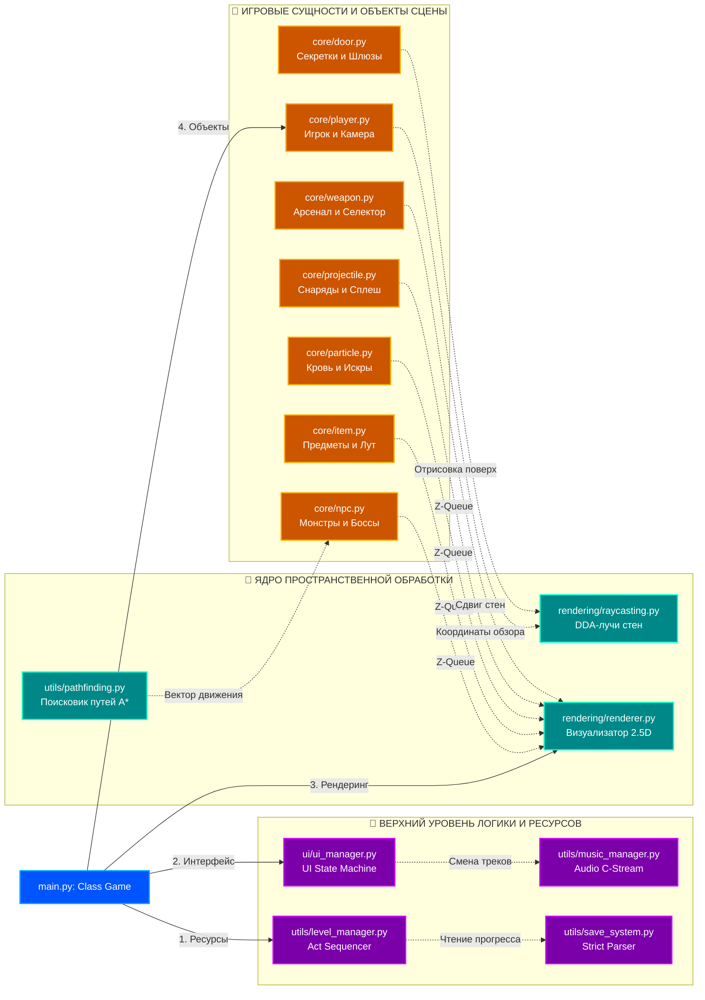
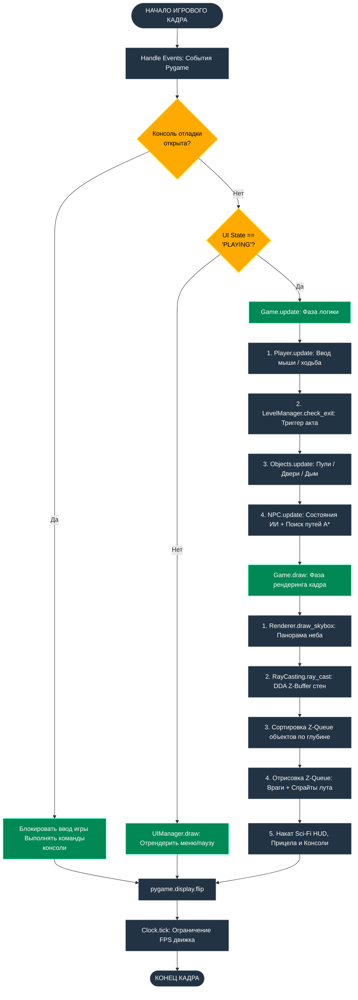

## 🗂️ ОГЛАВЛЕНИЕ
* [1. ⚔️ ВИЗИТНАЯ КАРТОЧКА ПРОЕКТА](#1-️-визитная-карточка-проекта)
  * [1.1. Сюжетная завязка и Лор](#11-сюжетная-завязка-и-лор)
  * [1.2. Ключевые особенности игры (Features)](#12-ключевые-особенности-игры-features)
  * [1.3. Стек технологий и спецификация зависимостей](#13-стек-технологий-и-спецификация-зависимостей)
  * [1.4. Быстрый старт и развертывание](#14-быстрый-старт-и-развертывание)
* [2. 🗺️ ОБЩЕЕ ДЕРЕВО ФАЙЛОВ СИСТЕМЫ](#2-️-общее-дерево-файлов-системы)
* [3. 🏛️ КОМПОНЕНТНО-ОРИЕНТИРОВАННАЯ АРХИТЕКТУРА И МЕНЕДЖЕРЫ](#3-️-компонентно-ориентированная-архитектура-и-менеджеры)
  * [3.1. Паттерн проектирования движка](#31-паттерн-проектирования-движка)
  * [3.2. Менеджеры ядра пространственной обработки (Core Managers)](#32-менеджеры-ядра-пространственной-обработки-core-managers)
  * [3.3. Менеджеры верхнего уровня логики и ресурсов (Upper Managers)](#33-менеджеры-верхнего-уровня-логики-и-ресурсов-upper-managers)
  * [3.4. Схема работы игрового цикла (Update/Draw)](#34-схема-работы-игрового-цикла-updatedraw)
* [4. 📂 DATA-DRIVEN КОНТУР И СИСТЕМА КОНФИГУРАТОРОВ](#4--data-driven-контур-и-система-конфигураторов)
  * [4.1. Декларативное управление биомами (biome_data.py)](#41-декларативное-управление-биомами-biome_datapy)
  * [4.2. Центральный реестр сущностей (game_data.py)](#42-центральный-реестр-сущностей-game_datapy)
  * [4.3. Изолированный профиль пользователя (user_settings.py)](#43-изолированный-профиль-пользователя-user_settingspy)
* [5. 👁️ ЯДРО РЕНДЕРИНГА И СГЛАЖИВАНИЯ (CORE RENDERING)](#5-️-ядро-рендеринга-и-сглаживания-core-rendering)
  * [5.1. Ускорение DDA-рейкастинга через Numba JIT](#51-ускорение-dda-рейкастинга-через-numba-jit)
  * [5.2. Алгоритм многоуровневого Mip-Mapping текстур](#52-алгоритм-многоуровневого-mip-mapping-текстур)
  * [5.3. Панорамный фон задника](#53-панорамный-фон-задника)
  * [5.4. Хоррор-фильтр визора и волновой туман дальности](#54-хоррор-фильтр-визора-и-волновой-туман-дальности)
* [6. 🎛️ ИНТЕРФЕЙС И UI-ФИЧИ (SCI-FI HUD PACK)](#6-️-интерфейс-и-ui-фичи-sci-fi-hud-pack)
  * [6.1. BIOS Boot Screen, Главное меню и HUD Паузы](#61-bios-boot-screen-главное-меню-и-hud-паузы)
  * [6.2. Интерактивный Keybinding без размытия](#62-интерактивный-keybinding-без-размытия)
  * [6.3. Геометрия тактического колеса оружия](#63-геометрия-тактического-колеса-оружия)
* [7. 🧠 ФИЗИКА, ИИ И МАТЕМАТИЧЕСКИЕ АЛГОРИТМЫ](#7--физика-ии-и-математические-алгоритмы)
  * [7.1. FSM-аниматор 8 ракурсов и полиморфный ИИ сущностей](#71-fsm-аниматор-8-ракурсов-и-полиморфный-ии-сущностей)
  * [7.2. Динамический инжект мозга через MethodType](#72-динамический-инжект-мозга-через-methodtype)
  * [7.3. Баллистика снарядов, Sub-stepping и радиальный Splash-урон](#73-баллистика-снарядов-sub-stepping-и-радиальный-splash-урон)
* [8. 🛠️ ИНСТРУМЕНТАРИЙ РАЗРАБОТЧИКА (DEV TOOLS)](#8-️-инструментарий-разработчика-dev-tools)
  * [8.1. Внутриигровая тильда-консоль (~)](#81-внутриигровая-тильда-консоль-~)
  * [8.2. Автономный Графический Редактор Карт (Map Editor)](#82-автономный-графический-редактор-карт-map-editor)
  * [8.3. Пайплайны компиляции релиза и Realm667 утилиты](#83-пайплайны-компиляции-релиза-и-realm667-утилиты)
  * [8.4. Руководство по расширению движка для новой команды разработки](#84-руководство-по-расширению-движка-для-новой-команды-разработки)

---

## 1. ⚔️ ВИЗИТНАЯ КАРТОЧКА ПРОЕКТА

<table align="center" width="100%">
  <tr>
    <td width="50%" align="center"><b>🎨 КОНЦЕПТ-АРТ ПРОЕКТА</b></td>
    <td width="50%" align="center"><b>🕹️ HUD И ГЕЙМПЛЕЙ ДВИЖКА</b></td>
  </tr>
  <tr>
    <!-- Фикс верстки: выравниваем медиа строго по центру ячеек, сохраняя родные пропорции пиксель-арта -->
    <td align="center" valign="middle">
      
    </td>
    <td align="center" valign="middle">
      
    </td>
  </tr>
</table>

### 1.1. Сюжетная завязка и Лор
> 🚨 **ОПЕРАТИВНОЕ ДОСЬЕ: ПРОТОКОЛ ВОЗМЕЗДИЯ**
> Родной и мирный город главного героя — **Илюши** — в одно мгновение превратился в радиоактивный пепел и руины. За этим чудовищным терактом стоял безумный гений, глава транснациональной научно-военной корпорации **Marvin** — зловещий доктор Марвин, испытавший на мирных жителях экспериментальную бомбу. 
> 
> Потеряв всё, Илюша встает на путь тотальной, яростной и хладнокровной мести (концептуальный трибьют инди-хиту *Vladik Brutal*). Вооружившись армейским арсеналом, он в одиночку штурмует циклопический бруталистический подземный комплекс Marvin. Его цель — зачистить 5 секторов базы, уничтожить армию киборгов и мутантов, остановить запуск реактора и лично наказать доктора Марвина.


### 1.2. Ключевые особенности игры (Features)
* 📐 **Aутентичный 2.5D Raycasting** — софтверный рендеринг стен методом DDA (Digital Differential Analysis), воссоздающий атмосферу и визуальный стиль легендарного ретро-гейминга 90-х.
* 🏛️ **Компонентно-Менеджерный Паттерн** — архитектура движка полностью разделена на изолированные функциональные узлы (Менеджеры), обеспечивающие независимую обработку графики, звука, ИИ и сохранений.
* 📂 **Глубокий Data-Driven Контур** — баланс оружия, параметры и 8-ракурсная анимация ИИ монстров, геометрия генерации процедурных биомов и цепочки актов кампании полностью вынесены во внешние конфигурационные файлы.
* 🖼️ **Аппаратный Mip-Mapping на CPU** — JIT-компилируемый алгоритм многоуровневого сглаживания текстур, который полностью устраняет пиксельный шум и мерцание на дальних дистанциях лабиринта.
* 🎛️ **Тактическая Экосистема HUD** — тактическое круговое колесо выбора оружия (Weapon Wheel) с тригонометрическим расчетом секторов, внутриигровая тильда-консоль и автономный графический редактор карт.

### 1.3. Стек технологий и спецификация зависимостей
Ядро движка функционирует на базе интерпретатора **Python `~=3.11`**. Для обеспечения стабильности среды разработки все зависимости привязаны к строгим версиям:

* **Интерфейс, окна и звук**: `pygame==2.6.1` [INDEX]
* **Математика векторов и матриц**: `numpy==2.4.6` [INDEX]
* **Машинная JIT-компиляция (LLVM)**: `numba==0.66.0` + `llvmlite==0.48.0` [INDEX]
* **Обработка графики, видео и анимаций**: `opencv-python==4.8.1.78`, `pillow==12.3.0`, `ffmpeg-python==0.2.0`, `vidmaker==2.3.0` [INDEX]
* **Сборщики дистрибутивов и отчетов**: `pyinstaller==6.21.0`, `reportlab==5.0.0` [INDEX]

<details>
<summary>📋 <b>Открыть полный системный слепок pip freeze (Зависимости окружения)</b></summary>

```text
altgraph==0.17.5
charset-normalizer==3.4.9
colorama==0.4.6
ffmpeg-python==0.2.0
future==1.0.0
llvmlite==0.48.0
numba==0.66.0
numpy==2.4.6
opencv-python==4.8.1.78
packaging==26.2
pefile==2024.8.26
pillow==12.3.0
pygame==2.6.1
pyinstaller==6.21.0
pyinstaller-hooks-contrib==2026.6
pywin32-ctypes==0.2.3
reportlab==5.0.0
setuptools==82.0.1
tqdm==4.67.3
vidmaker==2.3.0
```
</details>

### 1.4. Быстрый старт и развертывание

<details>
<summary>🚀 <b>Открыть пошаговую терминальную инструкцию по запуску проекта</b></summary>

1. **Клонирование репозитория проекта:**
```bash
git clone https://github.com
cd I_G
```

2. **Создание и запуск изолированного виртуального окружения (`.venv`):**
```bash
# Инициализация
python -m venv .venv

# Активация среды для Windows:
.venv\Scripts\activate

# Активация среды для Linux / macOS:
source .venv/bin/activate
```

3. **Установка зафиксированных версий библиотек экосистемы:**
```bash
python -m pip install --upgrade pip
pip install -r requirements.txt
```

4. **Команды запуска различных программных модулей движка:**
```bash
python main.py        # Запуск финальной релизной сборки кампании
python dev_mode.py    # Запуск отладочного режима на тестовом полигоне (act_test)
python devtools.py    # Запуск терминального пульта утилит разработчика
```
</details>

---

## 2. 🗺️ ОБЩЕЕ ДЕРЕВО ФАЙЛОВ СИСТЕМЫ

Ниже представлена детальная структурная карта репозитория игрового движка. Данная схема предназначена для быстрой ориентации новых разработчиков в архитектурных слоях проекта:

```text
📦 I_G (Корень проекта)
├── 📄 main.py                   # Глобальная точка входа: инициализация систем, игровой цикл, лимит FPS
├── 📄 dev_mode.py               # Изолированный дебаг-лаунчер быстрого старта тестовых полигонов (act_test)
├── 📄 devtools.py               # Терминальная док-панель инструментов разработчика (сборщики, компиляторы)
├── 📄 setting.py                # Монолитный файл статических констант (разрешение, углы FOV, текстурная сетка)
│
├── 📂 config/                   # СЛОЙ ДЕКЛАРАТИВНЫХ ДАННЫХ И КОНФИГУРАЦИЙ (Data-Driven Контур)
│   ├── 📄 __init__.py
│   ├── 📄 biome_data.py         # Весовые коэффициенты спавна, стили стен и параметры BSP-генерации комнат
│   ├── 📄 game_data.py          # Реестр паспортов оружия, физики NPC, размеров декораций и секвенсор актов
│   └── 📄 user_settings.py      # Изолированный профиль игрока (динамические бинды кнопок, сенса, громкость)
│
├── 📂 core/                     # ЯДРО ИГРОВЫХ СУЩНОСТЕЙ И МИКРОФИЗИКИ (Game Objects)
│   ├── 📄 player.py             # Физика скольжения вектора движения, опрос мыши, кастомные радиусы коллизий
│   ├── 📄 door.py               # Контроллер дверей-автоматов, цветных ключ-шлюзов и секретных стен-мимикриков
│   ├── 📄 item.py               # Логика предметов на полу (аптечки, броня), эффект парения, широкие спрайты пушек
│   ├── 📄 weapon.py             # Doom-анимация стволов от кадра к кадру, bobbing-покачивание при шаге, отдача
│   ├── 📄 weapon_selector.py    # Круговой тактический селектор (Weapon Wheel) слотов 1-6 по часовой стрелке
│   ├── 📄 projectile.py         # Физика быстрых снарядов, микрошаги sub-stepping, радиальный Splash-урон
│   ├── 📄 npc.py                # Мозг монстров, 8-ракурсный FSM конечный автомат ИИ, DDA-вектор падения трупа
│   └── 📄 particle.py           # Радиальный спавн искр выстрелов и брызг пиксельной крови на векторе гравитации
│
├── 📂 rendering/                # СЛОЙ РЕНДЕРИНГА И СИСТЕМ ВИЗУАЛИЗАЦИИ
│   ├── 📄 raycasting.py         # Высокоскоростное ядро DDA-лучей стен, JIT-компилируемое через Numba в LLVM
│   ├── 📄 renderer.py           # Отрисовка 2.5D пространства, панорамы скайбокса неба, синусоид HUD и прицела
│   └── 📄 flashlight.py         # Хоррор-маска темноты визора, динамический конус фонарика, волновой туман дальности
│
├── 📂 ui/                       # ГРАФИЧЕСКИЙ ИНТЕРФЕЙС ПОЛЬЗОВАТЕЛЯ (Graphical User Interface)
│   ├── 📄 ui_manager.py         # Sci-Fi терминал меню, BIOS загрузка, тактическая пауза, брифинги актов
│   └── 📄 console.py            # Внутриигровая тильда-консоль (~): godmode, ammo, сквозные прыжки по уровням
│
├── 📂 utils/                    # ВСПОМОГАТЕЛЬНЫЕ СИСТЕМЫ, ПАТЧИ И УТИЛИТЫ АВТОМАТИЗАЦИИ
│   ├── 📄 level_manager.py      # Act Sequencer кампании, пошаговое чтение JSON цепочек карт, чистка ОЗУ
│   ├── 📄 music_manager.py      # Системный C-стрим фонового аудио по стейтам UIManager
│   ├── 📄 pathfinding.py        # ИИ-поиск путей монстров методом А* по Манхэттенскому вектору координатной сетки
│   ├── 📄 sound_patch.py        # Прокси-класс SmartSound, Monkey-Patching микшера для процентного баланса звука
│   ├── 📄 save_system.py        # Строгий strict-парсер прогресса в текстовые INI-сейвы .sav
│   ├── 📄 intro_player.py       # Внешний перехватчик PowerPoint заставок через вызов .exe Bink плеера
│   ├── 📄 name_converter.py     # Конвертер Realm667: авто-флип ракурсов, сборка кадров боли и анимаций смерти
│   ├── 📄 generate_levels.py    # Процедурный генератор лабиринтов, комнат, секторов и DDA-валидации проходимости
│   └── 📄 project_to_txt.py     # Скрипт-сборщик исходного кода проекта в единый документ контекста для ИИ
│
└── 📂 map_editor/               # АВТОНОМНЫЙ ГРАФИЧЕСКИЙ РЕДАКТОР КАРТ УРОВНЕЙ
    ├── 📄 main.py               # Точка входа в редактор карт
    ├── 📄 editor.py             # Главный цикл окон редактора, кэш метаданных JSON
    ├── 📄 config.py             # Конфигурация интерфейсных размеров окон и путей текстур редактора
    ├── 📄 config_loader.py      # Мост прямой загрузки данных к game_data основного проекта игры
    ├── 📄 validators.py         # Валидатор корректности расстановки сущностей перед сохранением
    ├── 📂 tools/                # Инструменты рисования (кисть brush.py, ластик eraser.py, выделение selection.py)
    └── 📂 ui/                   # Компоненты UI (текстурный канвас canvas.py, инфо-бар статуса info_panel.py)
```
---

## 3. 🏛️ КОМПОНЕНТНО-ОРИЕНТИРОВАННАЯ АРХИТЕКТУРА И МЕНЕДЖЕРЫ

### 3.1. Паттерн проектирования движка
Архитектура игрового движка построена на **компонентно-ориентированном паттерне**, где монолитное центральное ядро — класс `Game` (или `DevGame` в отладочном лаунчере) — выступает исключительно в роли владельца контекста и главного координатора сигналов. 

Вместо запутанного наследования («спагетти-кода»), вся функциональность движка делегирована изолированным подсистемам. Структурной единицей проектирования является **Менеджер (Manager)** — автономный класс, инкапсулирующий логику конкретной игровой задачи. Менеджеры не имеют права напрямую переписывать свойства друг друга; всё межкомпонентное общение происходит строго через центральный контекст ядра `Game`, вызовы безопасных API-методов или глобальную смену стейтов UI-машины.




### 3.2. Менеджеры ядра пространственной обработки (Core Managers)
Эти компоненты функционируют на самом низком уровне и напрямую обрабатывают 2.5D геометрию, буферы пикселей и пространственные координаты:
* **`RayCasting` (Ядро DDA-сканирования)**: Математический вычислительный блок, JIT-компилируемый на лету. Пускает лучи сквозь Numpy-матрицу уровня, рассчитывает текстурные координаты стен, учитывает сдвиги открывающихся дверей и заполняет массив глубин `z_buffer` для корректного отсечения невидимых объектов.
* **`Renderer` (Визуализатор 2.5D сцены)**: Отвечает за финальный вывод пикселей на экран. Рисует панорамы скайбокса неба, проецирует вертикальные полосы стен с учетом Mip-Mapping, сортирует по глубине и отрисовывает очередь объектов (спрайты врагов, снаряды, частицы, лут) от дальних к ближним.
* **`PathFinder` (Поисковик путей А*)**: Навигационный процессор. На основе Манхэттенского вектора рассчитывает оптимальные маршруты перемещения монстров по дискретной сетке лабиринта, позволяя им эффективно обходить углы и преследовать Илюшу.

### 3.3. Менеджеры верхнего уровня логики и ресурсов (Upper Managers)
Компоненты верхнего уровня координируют ресурсы, игровые состояния и следят за ходом кампании:
* **`LevelManager` (Act Sequencer)**: Архитектурный контроллер кампании. Пошагово считывает JSON-цепочки карт из папок сюжета согласно реестру `ACTS_SEQUENCE`, отслеживает триггеры победы и полностью зачищает ОЗУ при смене уровней, предотвращая утечки памяти.
* **`UIManager` (UI State Machine)**: Глобальный конечный автомат состояний интерфейса (`BOOT`, `MENU`, `BRIEFING`, `PLAYING`, `PAUSE`, `LEVEL_END`, `DEAD`, `OPTIONS`). Управляет фокусом отрисовки окон и замораживает или возобновляет логику тиков геймплея.
* **`MusicManager` (Audio C-Stream Control)**: Звуковой процессор. Управляет потоковым воспроизведением тяжелой музыки `.wav` напрямую через низкоуровневые C-каналы микшера Pygame, динамически меняя треки в зависимости от стейтов игры.
* **`SaveSystem` (Strict Configuration Parser)**: Модуль сериализации данных. Записывает и парсит текстовые файлы прогресса `.sav` в формате `INI`. Оснащен строгой типизацией данных, страхующей Pygame от падения из-за некорректного считывания типов из текста.

### 3.4. Схема работы игрового цикла (Update/Draw)
Для предотвращения рассинхронизации данных и исключения графических артефактов (когда объект отрисовывается в старых координатах до того, как физика посчитала новые), внутри главного цикла `Game.run()` внедрено строгое разделение на фазы **Апдейта логики (Update)** и **Отрисовки кадра (Draw)**:



